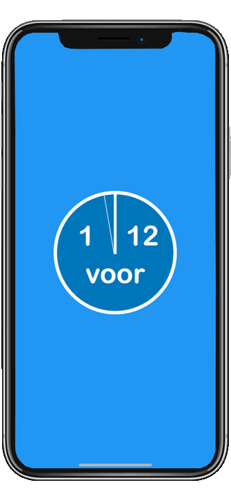

# Intro

Flutter version of the popular Dutch TV game show 'Twee voor 12'. You will get 12 questions. The first letters of the answers will form a word, but the letters are not yet in the right order. After answering the questions, you are allowed to ask where in the word a letter belongs. The goal is to guess the word as fast as possible (with asking the minimum number of letters).



# Platform compatibility

Because of the flutter packages used, the app currently only works on ios and android. Although flutter does support macos and web, the game will not work there.

# Authentication

The project uses firebase authentication. At the moment only Google is supported as an authentication provider. Firebase supports many other providers as well, but cross platform support is not always available. This example also shows how you can use a firebase realtime database to store and retrieve additional user claims. You can for example add a 'subscription' claim to a user account when they have bought the app and not show ads.

# Language support

The UI supports both English and Dutch. The initial language is based on device settings, but this can be changed in the app settings. Games can also be played in either English or Dutch. When choosing English as the game language only a single 'demo' game is available though. When playing the Dutch version a question bank containing thousands of questions and hundreds of words is available. The settings screen allows you to customize the games a little, such as choosing the game difficulty.

# Dark mode

The app settings allow you to choose dark mode if you want to. You can also let your device settings determine if dark mode is enabled or not.

# Ads

When using the ios / android simulator after question 6 a test ad will be played. When deploying to a real device no ad will be played at the moment.

# Developing

The following sections show some more technical details on how the app was created and what is required to run it locally and remotely.

## Firebase functions

Firebase functions are used to create (random) games. See the /functions folder for more details on how to use the firebase emulator suite locally.

## Initial creation

Create app:

```
flutter create one_for_twelve
```

## Using Firebase

In any directory run:

```
npm install -g firebase-tools (install firebase cli)
firebase login
dart pub global activate flutterfire_cli
```

Create project in the firebase console manually (one-for-12).

Then in project root run:

```
flutter pub add firebase_core
flutterfire configure (choose project one-for-twelve)
```

Now update the main.dart file so firebase is initialised when the app loads.

Test in all configurations: chrome, ios, android & macOS. In my case everything except macOS worked. For macOS I got a message:

Update the `platform :osx, '10.11'` line in your macOS/Podfile to version `platform :osx, '10.12'`.

After doing this it worked on macOS as well.

## Add Email/Password authentication:

In the firebase console for the project enable Authentication and add Email/Password and Google authentication. Add a single User with email test@test.com and password password.

In the project root run:

```
flutter pub add firebase_auth
```

Add widgets for the login screen and profile page and update main.dart.

Test all configurations. On my laptop all except macOS worked. To get macOS to work I needed to do allow Outgoing Connection in the macos Runner configuration using xcode:

https://github.com/firebase/firebase-ios-sdk/issues/8939

## Add Google authentication:

https://firebase.google.com/docs/auth/flutter/federated-auth

In the firebase console add the Google authentication provider.

Add google_sign_in package to the project:

```
flutter pub add google_sign_in
```

Add a button to the login screen that allows logging in using Google.

For ios you need to add some settings to the Info.plist (see https://pub.dev/packages/google_sign_in). Make sure you follow the instructions carefully.
I also had build errors in ios and followed the instructions here (https://github.com/rmtmckenzie/flutter_qr_mobile_vision/issues/129) to fix it:

```
cd ios
pod cache clean --all
pod repo update
pod update
cd ..
flutter clean
flutter build ios
```

I also had to open the ios runner project in xcode and select the correct team under "Signing and Capabilities".

For android configure the sha1 signing key for the android app in the firebase console project. You can get the key with this command (default pwd is android):

```
keytool -list -v -alias androiddebugkey -keystore ~/.android/debug.keystore
```

For flutter web follow these instructions:

```
https://github.com/flutter/plugins/tree/master_archive/packages/google_sign_in/google_sign_in_web#web-integration
```

For macOS it is a bit more involved and you need a different package:

```
https://github.com/flutter/flutter/issues/46157
https://pub.dev/packages/flutterfire_ui/example
```

## Troubleshooting

When enabling a firebase feature you must run 'flutterfire configure' again.

When using the firebase emulators for lambda functions the projectId must be specified in the .firebaserc file in the project root. The projectId becomes part of the url.

## Speeding up the xcode build for ios & macOS

If you use firebase, about 500k of c++ have to be compiled. To speed up the build you can use the precompiled code from git. See:

```
https://firebase.google.com/docs/firestore/quickstart
https://github.com/firebase/flutterfire/issues/9015
```

## Add splash screens and icon sets

For generating icons and splash screens for multiple platforms and api versions these 2 flutter / dart packages are used:

Splash screens: https://github.com/jonbhanson/flutter_native_splash  
Icons: https://pub.dev/packages/flutter_launcher_icons

To generate the splash screens:

```
flutter pub add flutter_native_splash
flutter pub run flutter_native_splash:create
```

And to generate the icon sets:

```
flutter pub add flutter_launcher_icons
flutter pub run flutter_launcher_icons:main
```

## Creating an animated gif to demo the game

As you probably noticed this README links to an animated gif in the repo that shows some screenshots of the game. I tried many things to create such an animated gif, but in the end created it like this:

1. Recorded some screenshots while playing the game by pressing the power & volume up buttons on my iphone at the same time.
2. Downloaded a png picture of an iphone frame (with a transparent background).
3. Created a custom shape in keynote that can be used as a mask for the screenshots to prevent them from covering the frame. The shape follows the display contours of the iphone frame. I saved this custom shape to my "shapes library".
4. Created several keynote slides containing the iphone frame image, the custom shape and the different images I wanted to show. I "masked" the images with the custom shape by selecting them together and choosing Format -> Image -> Mask with selection.
5. In keynote I exported the slides as an "animated gif".

The keynote presentation file (1_for_12_animated.key) is included in the /assets folder, so you can take a look how it was done.
